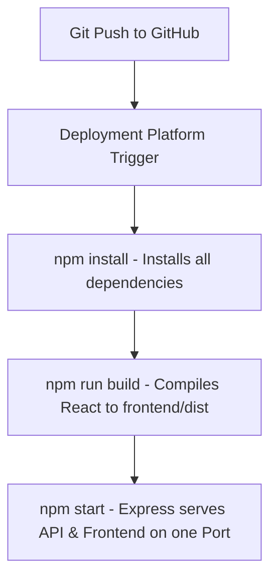
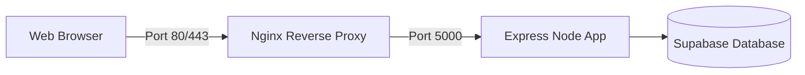

# 🚀 Trimly URL Shortener — Deployment Guide

This guide details how to build and deploy your **Trimly URL Shortener** application in a single-server configuration using **Render**, **Railway**, or **Amazon Web Services (AWS)**. 

Because your React frontend is compiled to a static bundle and served directly from the Express backend in production, you only need to host a **single Web Service/Server**! This makes deployment extremely fast, cost-effective, and easy to maintain.

---

## 🏗️ Architecture & Build Pipeline

The application features a root-level `package.json` that automates your entire fullstack build pipeline:



---

## ☁️ Option A: AWS App Runner (Serverless & Fully Managed)

AWS App Runner is the modern, serverless way to deploy containerized or runtime-based web apps on AWS. It handles infrastructure, load balancing, scaling, and SSL certificates automatically.

### Step 1: Connect your Repository
1. Log in to your [AWS Management Console](https://aws.amazon.com/console/).
2. Search for and open **AWS App Runner**.
3. Click **Create an App Runner service**.
4. Choose **Source code repository** and select your GitHub account/repository.

### Step 2: Configure Build Settings
Under the **Configure build** section:
* **Runtime:** `Node.js 18` (or Node.js 20)
* **Build command:** `npm install && npm run build`
* **Start command:** `npm start`
* **Port:** `5000`

### Step 3: Configure Service & Environment Variables
1. Give your service a name (e.g., `trimly-shortener`).
2. Add the following **Environment Variables**:
   * `NODE_ENV` = `production`
   * `SUPABASE_URL` = *your_supabase_url*
   * `SUPABASE_SERVICE_KEY` = *your_supabase_secret_key*
   * `JWT_SECRET` = *your_jwt_secret*
   * `JWT_EXPIRE` = `7d`
   * `BASE_URL` = *your_app_runner_default_url* (update after first build)
   * `FRONTEND_URL` = *your_app_runner_default_url*
3. Click **Next** -> **Create & Deploy**. AWS will provision the environment, compile the frontend, and launch your API globally!

---

## 🖥️ Option B: AWS EC2 (Traditional Linux VM / Free Tier Eligible)

For full control, you can deploy your application to an **AWS EC2 (t2.micro / t3.micro)** instance. This is 100% free-tier eligible.



### Step 1: Launch your EC2 Instance
1. Go to **EC2 Console** -> **Launch Instance**.
2. Name your instance and choose **Ubuntu Server 24.04 LTS**.
3. Select **t2.micro** (or **t3.micro** depending on region availability) for Free Tier.
4. Select or create a **Key Pair** for SSH access.
5. In **Network Settings (Security Group)**, ensure you allow:
   * **SSH** (Port 22)
   * **HTTP** (Port 80)
   * **HTTPS** (Port 443)

### Step 2: Connect & Install Node.js
SSH into your Ubuntu instance and run:
```bash
# Update packages
sudo apt update && sudo apt upgrade -y

# Install Node.js & npm (v20 LTS)
curl -fsSL https://deb.nodesource.com/setup_20.x | sudo -E bash -
sudo apt-get install -y nodejs

# Install PM2 (Process Manager) globally
sudo npm install -y -g pm2
```

### Step 3: Clone & Build the Application
```bash
# Clone your repository
git clone https://github.com/your-username/your-repo-name.git
cd your-repo-name

# Install all packages & build the production React bundle
npm install
npm run build
```

### Step 4: Configure Environment Variables
Create a `.env` file in the `backend/` folder:
```bash
nano backend/.env
```
Paste your production settings:
```env
PORT=5000
NODE_ENV=production
SUPABASE_URL=your_supabase_url
SUPABASE_SERVICE_KEY=your_supabase_service_key
JWT_SECRET=your_jwt_secret
JWT_EXPIRE=7d
BASE_URL=http://your-ec2-public-ip-or-domain
FRONTEND_URL=http://your-ec2-public-ip-or-domain
```
Press `Ctrl + O` and `Enter` to save, and `Ctrl + X` to exit.

### Step 5: Start with PM2
To ensure your Express server runs continuously in the background and restarts automatically if the server reboots:
```bash
# Start Express
pm2 start backend/index.js --name "trimly"

# Save PM2 state & enable startup boot
pm2 save
pm2 startup
```

### Step 6: Set up Nginx as a Reverse Proxy
To route incoming public web traffic (port `80`) to your Express app (port `5000`):
```bash
# Install Nginx
sudo apt install nginx -y

# Configure Nginx block
sudo nano /etc/nginx/sites-available/default
```
Replace the content inside the `location /` block with:
```nginx
server {
    listen 80 default_server;
    listen [::]:80 default_server;

    server_name _;

    location / {
        proxy_pass http://127.0.0.1:5000;
        proxy_http_version 1.1;
        proxy_set_header Upgrade $http_upgrade;
        proxy_set_header Connection 'upgrade';
        proxy_set_header Host $host;
        proxy_cache_bypass $http_upgrade;
    }
}
```
Save and exit (`Ctrl + O`, `Ctrl + X`), then verify and restart Nginx:
```bash
sudo nginx -t
sudo systemctl restart nginx
```

---

## ⚡ Deployment Option C: Render or Railway (Zero-Cost Platforms)

For Render or Railway steps, please consult the earlier section of this [Deployment Guide](file:///C:/Users/ASUS/.gemini/antigravity/brain/8e8fe65b-363c-4ba7-a151-3f381bdc7282/deployment_guide.md).
